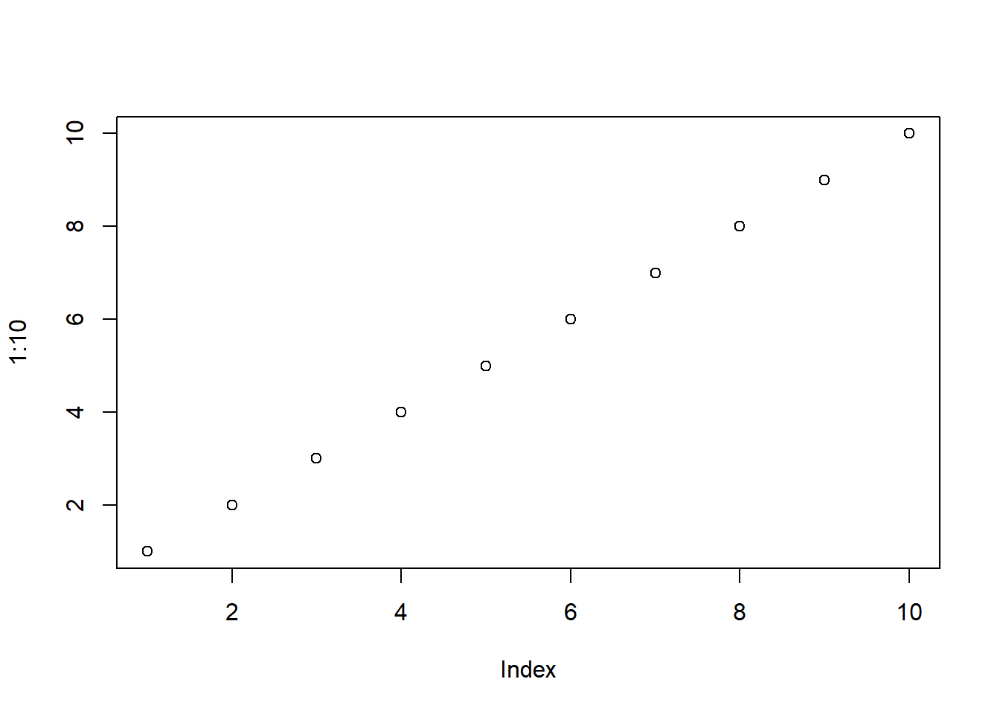
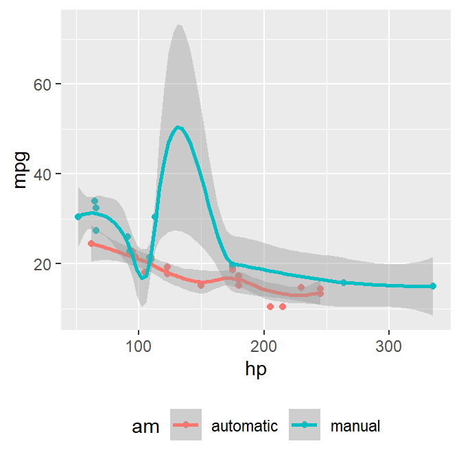
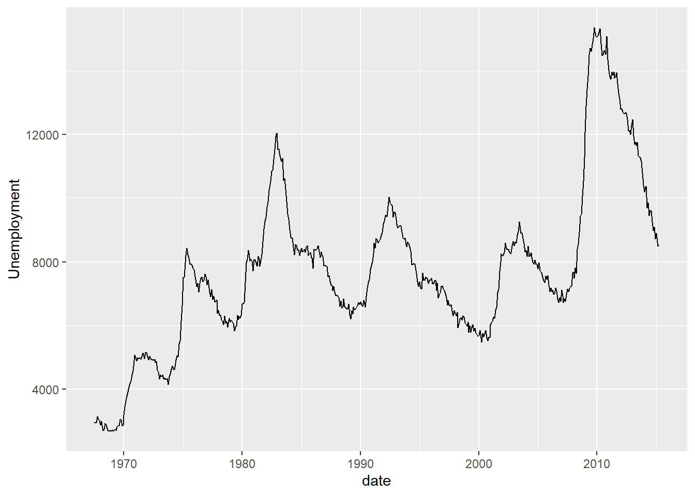

# Introduction {-}


**msmbstyle** is a styling package principally designed for the HTML version of @MSMB, with the explicit intention to closely match the layout an existing publication produced using Sweave and LaTeX.  The existing book layout was strongly influenced by the Tufte Handout style of Edward Tufte, and as such **msmbstyle** is based heavily on the [**tufte** package](https://github.com/rstudio/tufte) [@R-tufte], either calling code from that package directly, or modifying it when required. 

Pages produced by *msmbstyle* are designed to respond to different screen sizes.  For large screen chapter navigation of sections within a chapter is presented in a static list on the left hand side.  When the screen size is reduced this is replacd by an off-screen navigation panel that can be revealed with a button click.  Finally, for small screen the margin content is incorporated into the main body of the document, and navigation is availabe via the top-menu.

You can view the R Markdown documents used to create this site on [Github](https://github.com/aj2duncan/msmbstyle/tree/master/inst/rstudio/templates/project/resources).

## Basic usage {-}

To produce an HTML page using *"msmbstyle"* you need to set the output to  `msmbstyle::msmb_html_book` in the yaml header of your R Markdown file.  The header used in this example site is shown below:

```yaml
title: "MSMB HTML Book Style"
author: "Mike Smith"
date: "2021-08-30"
knit: "bookdown::preview_chapter"
site: "bookdown::bookdown_site"
output:
  msmbstyle::msmb_html_book:
    toc: TRUE
    toc_depth: 1
    split_by: chapter
    split_bib: no
    margin_references: FALSE
link-citations: yes
bibliography: msmbstyle-ex.bib
```

Currently it is mandatory to set `toc: TRUE` and `toc_depth: 1`.  Changing the first value will remove the list of chapters entirely which breaks the document navigation, and similarly setting the second to any other value will confuse the code that creates the drop-down navigation menu.  This will hopefully be made more configurable/robust in the future.  `split_by: chapter` is not mandatory, removing this will still prodoce a viable set of HTML pages, but the navigation will only allow you to move between the first page of each chapter.

`split_bib: no` and `margin_references: FALSE` are used to place the references in the final chapter of the book, and are used here as that was the format used in @MSMB.  It seems to work fine to change these if that is your preference.  You can then produce the HTML documents either via calling the function `bookdown::render_book()`.   

<div class="row"><div class="col-sm-3 margin-note"><span class="glyphicon glyphicon-info-sign" aria-hidden="true"></span> Alternatively, pressing the "Knit" button in an R Studio session will render only the chapter you are currently working on.  This is as a result of the `knit: "bookdown::preview_chapter"` entry in the YAML header.</div></div>

To build this website from R Markdown files distributed with the package, there are two main methods. First, if you use [RStudio](https://rstudio.com){target='_blank'} then you can either open a new project using the template `RStudio -> New Project -> From Template -> Bookdown Project using msmbstyle grid layout` or 

<div class='row test'>

<div class="col-sm-9">
```r
## find the example Rmd files and copy to a temporary directory
index_rmd <- list.files(system.file("extdata", package = "msmbstyle"),
                        full.names = TRUE)
file.copy(index_rmd, tempdir())

## change directory to where we've copied the files
## bookdown requires you to be in the same directory as the Rmd files.
setwd(tempdir())

## use bookdown to render the HTML pages
bookdown::render_book('index.Rmd', output_dir = 'msmb_example')

## open the first page in the default system browser
browseURL('msmb_example/index.html')
```
</div>

</div>


<!--chapter:end:index.Rmd-->

---
title: "MSMB HTML Book Style"
subtitle: "Example"
author: "Mike Smith & Andrew Duncan"
date: "2021-08-30"
knit: "bookdown::preview_chapter"
site: "bookdown::bookdown_site"
link-citations: yes
monofont: "Source Code Pro"
monofontoptions: "Scale=0.7"
output:
  msmbstyle::msmb_html_book:
    highlight: tango
    toc: TRUE
    toc_depth: 1
    split_by: chapter
    margin_references: FALSE
bibliography: msmbstyle-ex.bib
---

# Tables

Both of the examples below are taken from @MSMB.

## Main body tables

We have have tables in the main body of the text, as seen below in Table \@ref(tab:main-table).  Following the **tufte** convention the caption appears alongside in the margin.

<div class='row test'>

Table: (\#tab:main-table)Example of table appearing in the main body of the text.

|          |black |blue |green |grey |orange |purple |white |
|:---------|:-----|:----|:-----|:----|:------|:------|:-----|
|quiet     |2770  |2150 |2140  |875  |1220   |821    |2510  |
|angry     |2970  |1530 |1740  |752  |1040   |710    |1730  |
|clever    |1650  |1270 |1320  |495  |693    |416    |1420  |
|depressed |1480  |957  |983   |147  |330    |102    |1270  |
|happy     |19300 |8310 |8730  |1920 |4220   |2610   |9150  |
|lively    |1840  |1250 |1350  |659  |621    |488    |1480  |
|perplexed |110   |71   |80    |19   |23     |15     |109   |
|virtuous  |179   |80   |102   |20   |25     |17     |165   |

</div>

## Margin tables

You can also include tables in the margin column as in Table \@ref(tab:margin-table), with the caption above.

<div class='row test'>

<div class="col-sm-9">
```r
HIV <- data.frame(Patient = c('AHX112', 'AHX717', 'AHX543'), 
                           Mut1 = c(0, 1, 1),
                           Mut2 = c(0, 0, 0),
                           Mut3 = c(0, 1, 0),
                           '...' = rep(' ', 3))
knitr::kable(HIV, format = 'html', table.attr = 'class=\"margintab\"',
        caption = 'An example of a table in the margin.') 
```
</div>

<table class="margintab">
<caption>(\#tab:margin-table)An example of a table in the margin.</caption>
 <thead>
  <tr>
   <th style="text-align:left;"> Patient </th>
   <th style="text-align:right;"> Mut1 </th>
   <th style="text-align:right;"> Mut2 </th>
   <th style="text-align:right;"> Mut3 </th>
   <th style="text-align:left;"> ... </th>
  </tr>
 </thead>
<tbody>
  <tr>
   <td style="text-align:left;"> AHX112 </td>
   <td style="text-align:right;"> 0 </td>
   <td style="text-align:right;"> 0 </td>
   <td style="text-align:right;"> 0 </td>
   <td style="text-align:left;">  </td>
  </tr>
  <tr>
   <td style="text-align:left;"> AHX717 </td>
   <td style="text-align:right;"> 1 </td>
   <td style="text-align:right;"> 0 </td>
   <td style="text-align:right;"> 1 </td>
   <td style="text-align:left;">  </td>
  </tr>
  <tr>
   <td style="text-align:left;"> AHX543 </td>
   <td style="text-align:right;"> 1 </td>
   <td style="text-align:right;"> 0 </td>
   <td style="text-align:right;"> 0 </td>
   <td style="text-align:left;">  </td>
  </tr>
</tbody>
</table>

</div>

To achieve this we use the `kable()` function to produce the an HTML table with the attributes `margintab` & `marginnote`.  **msmbstyle** then provides the CSS required to place this table in the margin.

## Margin tables more

You can also include tables in the margin column as in Table \@ref(tab:margin-table), with the caption above.

<div class='row test'><table class="margintab">
<caption>(\#tab:margin-table-2)An example of a table in the margin.</caption>
 <thead>
  <tr>
   <th style="text-align:left;"> Patient </th>
   <th style="text-align:right;"> Mut1 </th>
   <th style="text-align:right;"> Mut2 </th>
   <th style="text-align:right;"> Mut3 </th>
   <th style="text-align:left;"> ... </th>
  </tr>
 </thead>
<tbody>
  <tr>
   <td style="text-align:left;"> AHX112 </td>
   <td style="text-align:right;"> 0 </td>
   <td style="text-align:right;"> 0 </td>
   <td style="text-align:right;"> 0 </td>
   <td style="text-align:left;">  </td>
  </tr>
  <tr>
   <td style="text-align:left;"> AHX717 </td>
   <td style="text-align:right;"> 1 </td>
   <td style="text-align:right;"> 0 </td>
   <td style="text-align:right;"> 1 </td>
   <td style="text-align:left;">  </td>
  </tr>
  <tr>
   <td style="text-align:left;"> AHX543 </td>
   <td style="text-align:right;"> 1 </td>
   <td style="text-align:right;"> 0 </td>
   <td style="text-align:right;"> 0 </td>
   <td style="text-align:left;">  </td>
  </tr>
</tbody>
</table>

</div>

<!--chapter:end:01-tables.Rmd-->

---
title: "MSMB HTML Book Style"
subtitle: "Example"
author: "Mike Smith & Andrew Duncan"
date: "2021-08-30"
knit: "bookdown::preview_chapter"
site: "bookdown::bookdown_site"
link-citations: yes
monofont: "Source Code Pro"
monofontoptions: "Scale=0.7"
output:
  msmbstyle::msmb_html_book:
    highlight: tango
    toc: TRUE
    toc_depth: 1
    split_by: chapter
    margin_references: FALSE
---

# Questions and Solutions

In teaching material it is common to want to include questions (and possibly solutions) to the reader.  It is possible to use [custom blocks](https://bookdown.org/yihui/bookdown/custom-blocks.html) to achieve distinct styling, however this doesn't provide internal labelling, referencing and numbering.   **bookdown** doesn't current provide an environment for questions and answers, although one can manipulate the various "[theorems](https://bookdown.org/yihui/bookdown/markdown-extensions-by-bookdown.html#theorems)" to achieve something similar.

**msmbstyle** provides a set of functions that can be used to demark questions and answers in the the R Markdown document.  They can be used either inline or in code chunks, and the precise usage may vary depending upon the complexity of the text you wish to include.

## Questions

### Simple question 

If your question is simply a paragraph of text, you can use `msmbstyle::question()` and provide the paragraph via the argument `text`.  We see an example of this approach below. 

<div class="row"><div class="col-sm-3 margin-note"><span class="glyphicon glyphicon-info-sign" aria-hidden="true"></span> The code is shown here, but it would be more typical to hide it via `echo = FALSE`</div></div>

<div class='row test'>

<div class="col-sm-9">
```r
msmbstyle::question(text = "Is this question displaying correctly?")
```
</div>


</div><div class='ques-sol' id=''><span class='question-begin'>&#x25BA; Question</span><div class='question-body'>Is this question displaying correctly?</div><span class='question-end'><span class='fa fa-square-o solution-icon'></span></span></div>


You can also include a question using inline code e.g. `` `r msmbstyle::question()` ``.  This is perhaps simpler than using code chunks, since it is unlikely we ever want to display the function call itself.  The question below is generated in this fashion.


<div class='ques-sol' id=''><span class='question-begin'>&#x25BA; Question</span><div class='question-body'>This is our second question.  It should not be numbered.  Is it?</div><span class='question-end'><span class='fa fa-square-o solution-icon'></span></span></div>


In addition to the `text` argument, you can also provide a `label` to the function. `label` is optional, and if provided can be used to reference the label in the main text of the book. Labels for questions must start with the string '*ques:*'  In Question \@ref(ques:two) we can see an example of a labelled question that can be referenced (as seen in this sentence).  

<div class="row"><div class="col-sm-3 margin-note"><span class="glyphicon glyphicon-info-sign" aria-hidden="true"></span> Currently using references to a question will result in a warning such as '`The label(s) ques:two not found`'.  This is because **knitr** is unable to resolve the reference (since this is an addon).  This is irritating, but can be ignored, and may be addressed in the future</div></div>


<div class='ques-sol' id='ques:two'><span class='question-begin'>&#x25BA; Question</span><div class='question-body'>This is our second question.  We expect this to have a number.</div><span class='question-end'><span class='fa fa-square-o solution-icon'></span></span></div>


#### Including `"code"` in a question. {-}

In order to include text formated to look like R code in you can use the sequence '`\x60`' to represent the backticks inside the text argument e.g.


<div class='ques-sol' id=''><span class='question-begin'>&#x25BA; Question</span><div class='question-body'>Does this question include `x` and `y`?</div><span class='question-end'><span class='fa fa-square-o solution-icon'></span></span></div>


### More complex questions

If you need to provide more detail than a single paragraph in a question, you can use the functions `question_begin()` and `question_end()` to demark the content of the document you wish to be included in the question. 

<div class="row"><div class="col-sm-3 margin-note"><span class="glyphicon glyphicon-info-sign" aria-hidden="true"></span> This is similar to using `\begin{}` and `\end{}` tags in a Latex document.</div></div>

They can again be called either inline or in code chunks (inline seems simpler) within the R Markdown document, and it is imperative they be used as a pair, otherwise the resulting document will have missmatched HTML tags. 

<div class="row"><div class="col-sm-3 margin-note"><span class="glyphicon glyphicon-info-sign" aria-hidden="true"></span> Currently there's no sanity checking for this, it's up to the author!</div></div>

The example below shows a question that involves several paragraphs of text, along with a code block and the output created by running this code. 


<div class='ques-sol' id=''><span class='question-begin'>&#x25BA; Question</span><div class='question-body'>


This is a more complex question.  It involves both this text, some code, and the plot produced by that code.

<div class='row test'>

<div class="col-sm-9">
```r
plot( 1:10 )
```
</div>

<div class="col-sm-9">

</div>
<div class="caption col-sm-3">(\#fig:longer-question)An informative correlation</div>
</div></div>

What do you think about the data shown in Figure \@ref(fig:longer-question)?


</div><span class="question-end"><span class="fa fa-square-o solution-icon"></span></span></div>


## Solutions

In similar fasion to questions, you can insert solutions using either the function `msmbstyle::solution()`, or a combination of `msmbstyle::solution_begin()` & `msmbstyle::solution_end()`.  *Currently solutions can not be labelled or reference in the text.  This is primarily because of an assumption that they would always have an accompanying question that could be referenced, and may change in the future.*

### Simple solution

Again, if your solution is just a single a paragraph of text, you can use `msmbstyle::solution()` and provide the paragraph via the argument `text`.  We see an example of this approach below:


<div class='ques-sol'><span class='solution-begin'>&#x25BA; Solution<span id='sol-start-1' class="fa fa-plus-square solution-icon clickable" onclick="toggle_visibility('sol-body-1', 'sol-start-1')"></span></span><div class="solution-body" id = "sol-body-1" style="display: none;"><p>This is a single paragraph providing an answer.</p></div><span class="solution-end"><span class="fa fa-square-o solution-icon"></span></span></div>


There are additional arguments to this function: `header` and `toggle`.  `header` allows you to set the headeing text that begins a solution e.g. if you would rather they were called 'answers'.  `toggle` expects a logical which, if set to `TRUE` (the default), will create the solution in a 'collapsed' format.  Pressing the plus icon will then show the content of the solution.  This gives the option of initially hiding a solution, so the reader is forced into taking an active step to reveal the answer.  

Below is an example where the collapsing behaviour has been turned off and the section header renamed.

<div class='row test'>

<div class="col-sm-9">
```r
msmbstyle::solution(text = "This an 'Answer' and cannot be hidden",
                    header = "Answer",
                    toggle = FALSE)
```
</div>


</div><div class='ques-sol'><span class='solution-begin'>Answer</span><div class="solution-body"><p>This an 'Answer' and cannot be hidden</p></div><span class="solution-end"><span class="fa fa-square-o solution-icon"></span></span></div>


### More complex solutions

More comprehensive solutions can similarly be indicated with calls to `solution_begin()` and `solution_end()`.  The first of these takes the same arguments as `solution()` allowing you to set the visibility toggle and section heading text.


<div class='ques-sol'><span class='solution-begin'>&#x25BA; Solution<span id='sol-start-3' class="fa fa-plus-square solution-icon clickable" onclick="toggle_visibility('sol-body-3', 'sol-start-3')"></span></span><div class="solution-body" id = "sol-body-3" style="display: none;">


This is a more complex solution. We'll reuse some plotting code from the **tufte** vignette to include a figure in the margin.

<div class='row test'><div class="col-sm-3 col-sm-push-9">

<div class="caption">(\#fig:fig-margin2)MPG vs horsepower, colored by transmission.</div>
</div>

<div class="col-sm-9 col-sm-pull-3">
```r
library(ggplot2)
mtcars2 <- mtcars
mtcars2$am <- factor(
  mtcars$am, labels = c('automatic', 'manual')
)
ggplot(mtcars2, aes(hp, mpg, color = am)) +
  geom_point() + geom_smooth() +
  theme(legend.position = 'bottom')
```
</div>


<div class="col-sm-9 col-sm-pull-3">
```
## `geom_smooth()` using method = 'loess' and formula 'y ~ x'
```
</div>

</div>


</div><span class="solution-end"><span class="fa fa-square-o solution-icon"></span></span></div>


Everything including the margin figure is contained within our 'collapsed' solution environment and can be revealed by clicking on the plus symbol.


<!--chapter:end:02-questions.Rmd-->

---
title: "MSMB HTML Book Style"
subtitle: "Example"
author: "Mike Smith"
date: "2021-08-30"
knit: "bookdown::preview_chapter"
site: "bookdown::bookdown_site"
link-citations: yes
monofont: "Source Code Pro"
monofontoptions: "Scale=0.7"
output:
  msmbstyle::msmb_html_book:
    highlight: tango
    toc: TRUE
    toc_depth: 1
    split_by: chapter
    margin_references: FALSE
bibliography: msmbstyle-ex.bib
---

# Figures and Margin Content

When using **msmbstyle** you can make use of all the plot configuration settings that are provided by [**bookdown**](https://www.bookdown.org) and [**tufte**](https://github.com/rstudio/tufte), including references, figure captions, and margin figures.

The examples shown below are taken directly from the **tufte** vignette (https://rstudio.github.io/tufte/) to demonstrate how they are styled by **msmbstyle**.

## Margin Figures

Images and graphics play an integral role in Tufte's work. To place figures in the margin you can use the **knitr** chunk option `fig.margin = TRUE`. For example:

<div class='row test'><div class="col-sm-3 col-sm-push-9">

<div class="caption">(\#fig:fig-margin)MPG vs horsepower, colored by transmission.</div>
</div>

<div class="col-sm-9 col-sm-pull-3">
```r
library(ggplot2)
mtcars2 <- mtcars
mtcars2$am <- factor(
  mtcars$am, labels = c('automatic', 'manual')
)
ggplot(mtcars2, aes(hp, mpg, color = am)) +
  geom_point() + geom_smooth() +
  theme(legend.position = 'bottom')
```
</div>


<div class="col-sm-9 col-sm-pull-3">
```
## `geom_smooth()` using method = 'loess' and formula 'y ~ x'
```
</div>

</div>

Note the use of the `fig.cap` chunk option to provide a figure caption. You can adjust the proportions of figures using the `fig.width` and `fig.height` chunk options. These are specified in inches, and will be automatically scaled down to fit within the handout margin.

## Arbitrary Margin Content

In fact, you can include anything in the margin using the **knitr** engine named `marginfigure`. Unlike R code chunks ```` ```{r} ````, you write a chunk starting with ```` ```{marginfigure} ```` instead, then put the content in the chunk. See an example on the right about the first fundamental theorem of calculus.

<div class="row">
<div class="col-sm-3 margin-note">
<div>We know from <em>the first fundamental theorem of calculus</em> that for <span class="math inline">\(x\)</span> in <span class="math inline">\([a, b]\)</span>: <span class="math display">\[\frac{d}{dx}\left( \int_{a}^{x} f(u)\,du\right)=f(x).\]</span></div>
</div>
</div>

For the sake of portability between LaTeX and HTML, you should keep the margin content as simple as possible (syntax-wise) in the `marginfigure` blocks. You may use simple Markdown syntax like `**bold**` and `_italic_` text, but please refrain from using footnotes, citations, or block-level elements (e.g. blockquotes and lists) there.

## Footnotes

Footnotes will also appear in the margin, and are numbered sequentially based on their appearence in the book. [^1]

[^1]: Make sure you use unique footnote references throughout the book, they should not be reused between chapters.

## Full Width Figures

You can arrange for figures to span across the entire page by using the chunk option `fig.fullwidth = TRUE`.

<div class='row test'>

<div class="col-sm-9">
```r
ggplot(diamonds, aes(carat, price)) + geom_smooth() +
  facet_grid(~ cut)
```
</div>


<div class="col-sm-9">
```
## `geom_smooth()` using method = 'gam' and formula 'y ~ s(x, bs = "cs")'
```
</div>

<div class="figure col-sm-12">

<p class="caption col-sm-3 col-sm-push-9">(\#fig:fig-fullwidth)A full width figure.</p>
</div></div>

 Other chunk options related to figures can still be used, such as `fig.width`, `fig.cap`, `out.width`, and so on. For full width figures, usually `fig.width` is large and `fig.height` is small. In the above example, the plot size is $10 \times 2$.

## Main Column Figures

Besides margin and full width figures, you can of course also include figures constrained to the main column. This is the default type of figures in the LaTeX/HTML output.

<div class='row test'>

<div class="col-sm-9">
```r
ggplot(diamonds, aes(cut, price)) + geom_boxplot()
```
</div>

<div class="col-sm-9">

</div>
<div class="caption col-sm-3">(\#fig:fig-main)A figure in the main column.</div>
</div></div>


<!--chapter:end:03-figures.Rmd-->

---
title: "MSMB HTML Book Style"
subtitle: "Example"
author: "Mike Smith & Andrew Duncan"
date: "2021-08-30"
knit: "bookdown::preview_chapter"
site: "bookdown::bookdown_site"
link-citations: yes
monofont: "Source Code Pro"
monofontoptions: "Scale=0.7"
output:
  msmbstyle::msmb_html_book:
    highlight: tango
    toc: TRUE
    toc_depth: 1
    split_by: chapter
    margin_references: FALSE
bibliography: msmbstyle-ex.bib
---

# Other Additions

Since forking the original project there have been some small additions. 

## Code Highlighting

As the intension with this package is to produce a HTML book, some of the code highlighting syntax from [xaringan](https://slides.yihui.org/xaringan/#31){target='_blank'} by ending a line with a comment `#<<`. For example a code chunk like this:


```md
library(ggplot2)
ggplot(economics, aes(x = date, y = unemploy)) + 
  geom_line() +                                   #<<
  labs(y = "Unemployment")
```


will be rendered as 

<div class='row test'>

<div class="col-sm-9">
```r
library(ggplot2)
ggplot(economics, aes(x = date, y = unemploy)) + 
  geom_line() +                                  #<<
  labs(y = "Unemployment")
```
</div>

</div>

## RStudio Project Template

It is now possible to open an RStudio project with these files as a template. `RStudio -> New Project -> From Template -> Bookdown Project using msmbstyle grid layout`.


## CSS Changes

Aside from adding code highlighting, the following css has been altered from the original.

- Added spacing to headers to improve page position when using the side menu
- Altered css for tables
- Changed navbar and header css to match preferred colours

### Changing Code Highlighted 

The css for the highlighted code is defined by:

```css
.highlighted-code {
  background-color: #cf95dc; 
  min-height: 1em;
  display: block;
  margin-bottom: -20px;
}
```


<!--chapter:end:04-Additions.Rmd-->


# References {-}


<!--chapter:end:99-references.Rmd-->

